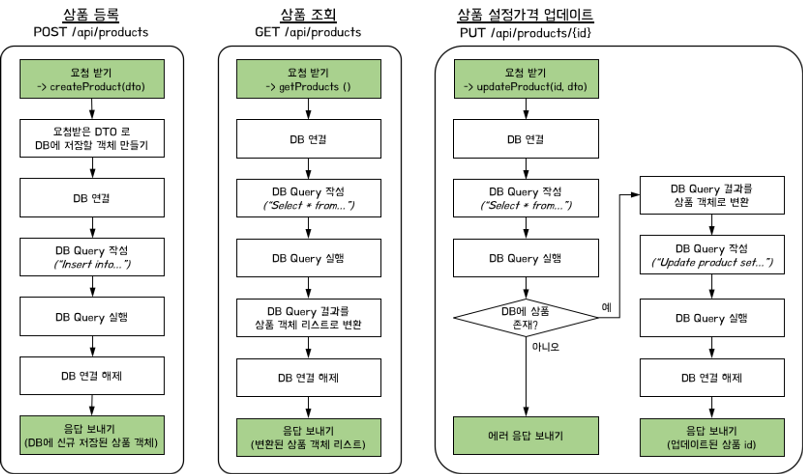
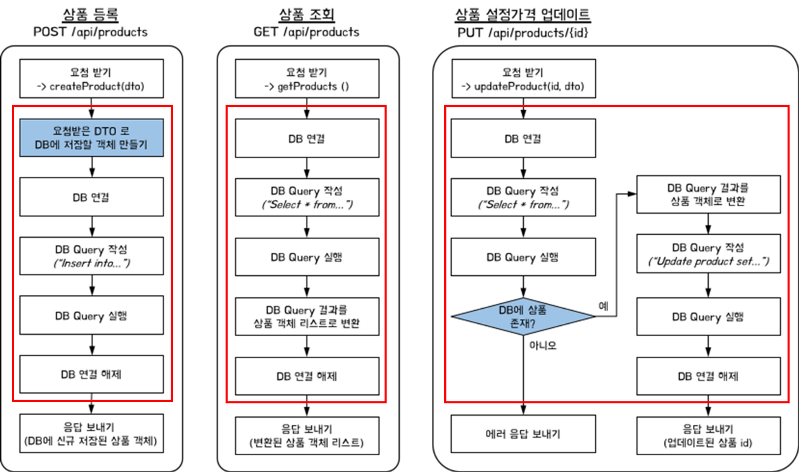
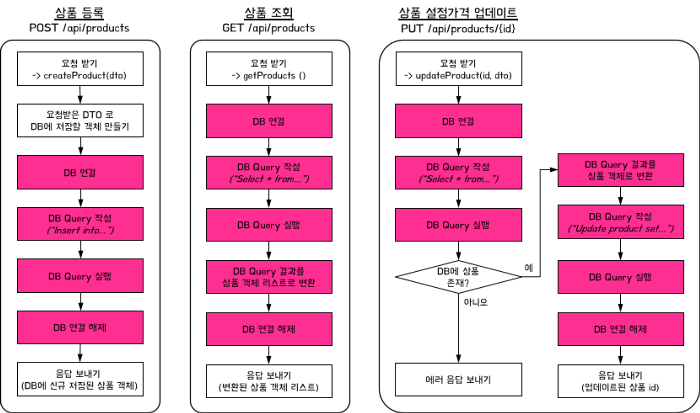

# MySelectShop
- - -
## 🐱 myselectshop 서비스 소개
1. 키워드로 상품검색 -> 결과를 목록으로 보여줌
2. 관심상품 등록하기
3. 관심상품 조회하기
4. 관심상품 최저가 등록하기
5. 회원가입
6. 로그인
- - -
## 🦄 API 명세서
|기능|Method|URL|Request|Response|
|---|---|---|---|---|
|메인페이지|`GET`|/api/shop|-|index.html|
|키워드로상품검색->결과목록으로보여주기|`GET`|/api/search?query=검색어|-|[ { "title":String, "link":String, "image":String, "lprice":int }, ... ]|
|관심상품 등록하기|`POST`|/api/products|{ "title":String, "link":String, "image":String, "lprice":int }|{ "id":Long, "title":String, "link":String, "image":String, "lprice":int, "myprice":int }|
|관심상품 조회하기|`GET`|/api/products|-|[ { "id":Long, "title":String, "link":String, "image":String, "lprice":int, "myprice":int }, ... ]|
|관심상품 최저가 등록하기|`PUT`|/apiproducts/{id}|{ "myprice":int }|id|
|회원가입 페이지|`GET`|/api/user/signup|-|signup.html|
|회원가입|`POST`|/api/user/signup|POST Form 태그 { "username":String, "password":String, "email":String, "admin":boolean, "adminToken":String }|redirect:/api/user/login|
|로그인 페이지|`GET`|/api/user/login|-|login.html|
|로그인|`POST`|/api/user/login|POST Form 태그 { "username":String, "password":String }|redirect:/api/shop|
- - -
## 🐣 AllInOneController 관심사 분리하기
[AllInOneController]

1. Controller 역할 구분

2. Service 역할 구분

3. Repository 역할 구분

- - -
## 🐳 Refactoring 후, 개선점
(AllInOneController 한계점과 비교)
* 한 개의 클래스에 너무 많은 양의 코드 존재
  * 코드 이해가 어려움
  * -> 3개의 클래스에 역할별로 코드 정리 완료

* 코드 추가/변경 요청에 대한 대응
  * 관심상품 등록 -> Client Response하는 값 변경
  * (등록된 Product 전체 정보 -> 등록된 Product id)
  * -> Controller 역할
  
  * 최저가 Myprice 업데이트 조건 변경
  * (Client가 최저가를 0 이하로 입력 -> Error!)
  * -> Service 역할
  
  * DB 테이블 이름 변경
  * (Product 테이블 lprice -> lowprice로 변경)
  * -> Repository 역할